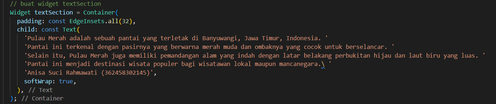

# layout_flutter

## PRAKTIKUM 1: Membangun Layout di Flutter

### Langkah 1: Buat Project Baru
Seperti biasa yaitu klik 'shift+crtl+P' secara bersamaan untuk membuat projek baru dengan nama layout_flutter.

### Langkah 2: Buka filelib/main.dart
Mengganti kode dengan kode sebagai berikut:

dan jika dirunning di emulator hasilnya akan jadi seperti gambar di bawah ini

### Langkah 3: Idetinfikasi layout diagram

### Langkah 4: Implementasi title row
Tambahkan kode ini pada bagian atas metode build() di dalam kelas MyApp

lalu saya mengisi bagian kodingan yang kosong dengan perintah yang ada di modul yang diberikan

kemudian ganti isi body text 'Hello World' dengan variabel titleSection

body text hello world jadikan comen agar dia tidak jalan ketika dirunning

## PRAKTIKUM 2: Implementasi Button Row

### Langkah 1: Buat method Column _buildButtonColumn
Membuat metode bernama buildButtonColumn(), yang memiliki parameter warna, ICon dan Text

### Langkah 2: Buat widget buttonSection
Tambahkan kode berikut tepat di bawah deklarasi titleSection di dalam metode build()

### Langkah3: Tambah button section ke body
Tambahkan variabel buttonSection ke dalam body

## PRAKTIKUM 3: Implementasi text section

### Langkah 1: Buat widget textSection
Tentukan bagian teks sebagai variabel. Masukkan teks ke dalam Container dan tambahkan padding di sepanjang setiap tepinya. Tambahkan kode berikut tepat di bawah deklarasi buttonSectio

### Langkah 2: Tambahkan variabel text section ke body
Tambahkan widget variabel textSection ke dalam body

## PRAKTIKUM 4: Implementasi image section

### Langkah 1: Siapkan aset gambar
Pertama-tama buat dulu folder dengan nama 'images' di root projek layout_flutter. Kemudian masukkan gambar yang dipilih dari internet, saya memilih Pulau Merah dan set nama file tersebut ke file pubspec.yaml seperti ini

### Langkah 2: Tambahkan gambar ke body
Tambahkan aset gambar ke dalam body

### Langkah 3: Terakhir, ubah menjadi ListView
Pada langkah terakhir ini, atur semua elemen dalam ListView, bukan Column, karena ListView mendukung scroll yang dinamis saat aplikasi dijalankan pada perangkat yang resolusinya lebih kecil.

## HASIL AKHIR TUGAS PRAKTIKUM
